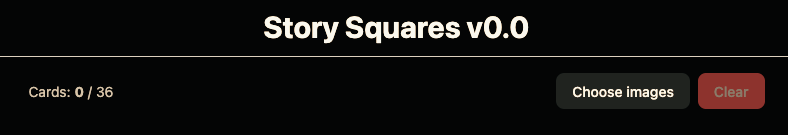
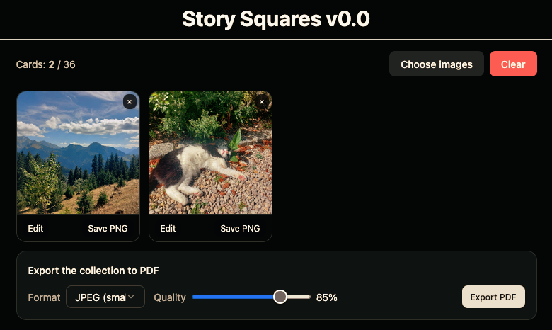
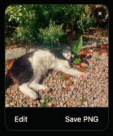

# Story Squares v0.0

**Story Squares** — веб-приложение для быстрого создания квадратных фото-историй/открыток из ваших снимков. 

Рабочая версия приложения доступна по ссылке https://alexbukreev.github.io/story-squares/

> ⚠️ Проект в активной разработке (MVP). Этот README описывает пользовательские сценарии текущей версии.

## Загрузка фотографий

Наэмите на кнопку `Choose images` и выберите фото для загрузки. Поддерживается монжественная загрузка. Максимальное число файлов для загрузки 36 шт.

После загрузки хотя бы одного файла доступны их редактирование и просмотр.

## Редактирование

Про редактирование

## Просмотр
Про просмотр

## Основные возможности (план MVP)

* Загрузка \~36 фотографий (drag-and-drop + выбор файлов).
* Авторазмещение по выбранному квадратному шаблону (слоты разных форм).
* Ручная подгонка: зум, позиция кадра, `cover/contain`, вкл/выкл масок.
* Подписи к фото и опциональный **QR-код** (генерация внутри приложения).
* Экспорт: пакет **JPEG/PNG** (на устройство/в ZIP) и общий **PDF**.
* Сохранение/загрузка проекта (локально, в браузере).
* Работа офлайн (PWA) и приватность: все данные остаются у пользователя.

---

