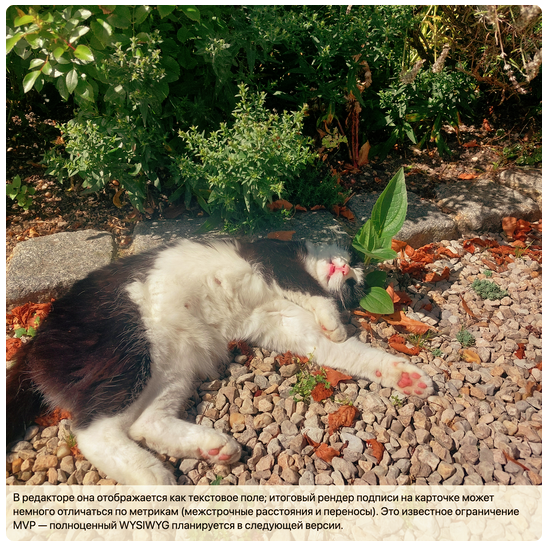

# Story Squares v0.0

**Story Squares** — веб-приложение для быстрого создания квадратных фото-историй/открыток из ваших снимков. Всё работает локально в браузере.

Рабочая версия: [https://alexbukreev.github.io/story-squares/](https://alexbukreev.github.io/story-squares/)

> ⚠️ Проект в активной разработке (MVP). Ниже описаны сценарии текущей версии.

## Загрузка фотографий

Нажмите **Choose images** и выберите снимки. Поддерживается множественная загрузка. Максимум — **36** файлов.

После загрузки хотя бы одного файла становятся доступны просмотр и редактирование.

## Редактирование

Нажмите **Edit** на карточке, чтобы открыть окно редактирования.
Позиционирование и масштаб выполняются тремя ползунками под изображением (позже переедет прямо на фото).

Подпись поддерживает несколько строк. В редакторе она отображается как текстовое поле; итоговый рендер подписи на карточке может немного отличаться по метрикам (межстрочные расстояния и переносы). Это известное ограничение MVP — полноценный WYSIWYG планируется в следующей версии.

* Подпись в редакторе:

* Итоговый вид подписи на изображении/в PDF:

> Форматирование текста (цвет, размер, начертание) пока отсутствует.

## Просмотр

Клик по превью карточки открывает полноразмерный **предпросмотр** — именно в том виде, в каком изображение попадёт в PNG и PDF. Из окна предпросмотра можно сохранить PNG и перейти в редактор.

## Экспорт в файл (PNG)

Экспортирует текущую карточку в PNG с именем `card.png`. В будущих версиях появится настраиваемая схема именования всей коллекции.

## Экспорт в PDF

Внизу страницы находится панель экспорта в PDF с выбором формата изображений и качества:

* **JPEG (smaller)** — меньше размер файла, ниже качество при сильной компрессии.
* **PNG (lossless)** — без потерь, но крупнее.

Во время сборки отображается прогресс со временем и ETA.

## Известные ограничения MVP

* Подпись в редакторе визуально может отличаться от финального рендера (нет полного WYSIWYG).
* Нет форматирования текста (цвет/размер/жирность).
* Имя PNG пока фиксированное.
* Максимум 36 фото за сессию.

## План на следующую версию

* Полное соответствие подписи в редакторе финальному виду (**WYSIWYG**).
* Настройки форматирования текста (цвет, размер, начертание).
* Добавление **QR-кода** и генерация его содержимого в приложении.
* Позиционирование изображения жестами прямо на фото (без ползунков).
* Перестановка карточек в коллекции (изменение порядка экспорта).
* Схема именования файлов при выгрузке.
* Сохранение/загрузка проекта локально в браузере.
